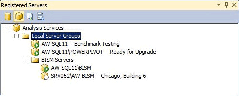

# Register an Analysis Services Instance in a Server Group
  If you have a large number of Analysis Services server instances, you can create server groups in Management Studio to make server administration easier. The purpose of a server group is to provide proximity among a group of related servers within the administrative workspace. For example, suppose you are tasked with managing ten separate instances of Analysis Services. Grouping them by server mode, up-time criteria, or by department or region would allow you to view and connect to instances that share the same characteristics more easily. You can also add descriptive information that helps you remember how the server is used.  
  
   
  
 Server groups can be created in a hierarchical structure. Local Server Group is the root node. It always contains instances of Analysis Services that run on the local computer. You can add remote servers to any group, including the local group.  
  
 After you create a server group, you must use the Registered Servers pane to view and connect to the member servers. The pane filters SQL Server instances by server type (Database Engine, Analysis Services, Reporting Services, and Integration Services). You click a server type to view the server groups created for it. To connect to a specific server within group, you double-click a server in the group.  
  
 The connection information that is defined for the server, including the server name, is persisted with server registration. You cannot modify the connection information, or use the registered name when connecting to the server using other tools.  
  
## Create a Server Group and Add Registered Servers  
  
1.  In Management Studio, click Registered Servers on the View menu to open the Registered Servers pane in the workspace. By default, a local Server Group is already created. All instances of Analysis Services that are running on the local server are members.  
  
2.  Right-click Local Server Group, select New Server Group, and give the group a name.  
  
3.  Right-click the server group and select New Server Registration. Enter the network name of a local or remote server, including the instance name if the server was installed as a named instance. Optionally, you can provide a registered server name that appears in Registered Servers. This name is used in Registered Servers only. You cannot use it to rename a server, nor can you use it in a connection string. A registered server name can be more descriptive than the actual server name or include other identifying characteristics that help you distinguish this server from other servers.  
  
  
