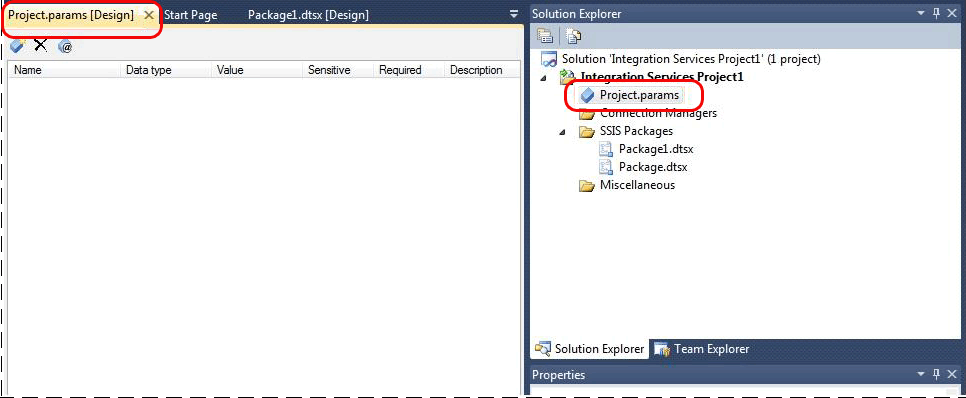

# Create Parameters
  You use [!INCLUDE[ssBIDevStudioFull](../includes/ssbidevstudiofull-md.md)] to create project parameters and package parameters. The following procedures provide step-by-step instructions for creating package/project parameters.  
  
> [!NOTE]  
>  If you are converting a project that you created using an earlier version of [!INCLUDE[ssISnoversion](../includes/ssisnoversion-md.md)] to the project deployment model, you can use the **Integration Services Project Conversion Wizard** to create parameters based on configurations. For more information, see [Deploy Projects to Integration Services Server](../../2014/integration-services/deploy-projects-to-integration-services-server.md).  
  
### To create package parameters  
  
1.  Open the package in [!INCLUDE[ssBIDevStudio](../includes/ssbidevstudio-md.md)], and then click the **Parameters** tab in the SSIS Designer.  
  
       
  
2.  Click the **Add Parameter** button on the toolbar.  
  
       
  
3.  Enter values for the **Name**, **Data Type**, **Value**, **Sensitive**, and **Required** properties in the list itself or in the **Properties** window. The following table describes these properties.  
  
    |Property|Description|  
    |--------------|-----------------|  
    |Name|The name of the parameter.|  
    |Data type|The data type of the parameter.|  
    |Default value|The default value for the parameter assigned at design time. This is also known as the design default.|  
    |Sensitive|Sensitive parameter values are encrypted in the catalog and appear as a NULL value when viewed with Transact-SQL or SQL Server Management Studio.|  
    |Required|Requires that a value, other than the design default, is specified before the package can execute.|  
    |Description|For maintainability, the description of the parameter. In [!INCLUDE[ssBIDevStudioFull](../includes/ssbidevstudiofull-md.md)], set the parameter description in the Visual Studio Properties window when the parameter is selected in the applicable parameters window.|  
  
    > [!NOTE]  
    >  When you deploy a project to the catalog, several more properties become associated with the project. To see all properties for all parameters in the catalog, use the [catalog.object_parameters &#40;SSISDB Database&#41;](/sql/integration-services/system-views/catalog-object-parameters-ssisdb-database) view.  
  
4.  Save the project to save changes to parameters. Parameter values are stored in the project file.  
  
    > [!WARNING]  
    >  You can in-place edit in the list or use the **Properties** window to modify the values of parameter properties. You can delete a parameter by using the **Delete (X)** toolbar button. Using the last toolbar button, you can specify a value for a parameter that is used only when you execute the package in [!INCLUDE[ssBIDevStudio](../includes/ssbidevstudio-md.md)].  
  
    > [!NOTE]  
    >  If you re-open the package file without opening the project in [!INCLUDE[ssBIDevStudio](../includes/ssbidevstudio-md.md)], the **Parameters** tab will be empty and disabled.  
  
### To create project parameters  
  
1.  Open the project in [!INCLUDE[ssBIDevStudio](../includes/ssbidevstudio-md.md)].  
  
2.  Right-click **Project.params** in Solution Explorer, and then click **Open** (OR) double-click **Project.params** to open it.  
  
       
  
3.  Click the **Add Parameter** button on the toolbar.  
  
       
  
4.  Enter values for the **Name**, **Data Type**, **Value**, **Sensitive**, and **Required** properties.  
  
    |Property|Description|  
    |--------------|-----------------|  
    |Name|The name of the parameter.|  
    |Data type|The data type of the parameter.|  
    |Default value|The default value for the parameter assigned at design time. This is also known as the design default.|  
    |Sensitive|Sensitive parameter values are encrypted in the catalog and appear as a NULL value when viewed with Transact-SQL or SQL Server Management Studio.|  
    |Required|Requires that a value, other than the design default, is specified before the package can execute.|  
    |Description|For maintainability, the description of the parameter. In [!INCLUDE[ssBIDevStudio](../includes/ssbidevstudio-md.md)], set the parameter description in the Visual Studio Properties window when the parameter is selected in the applicable parameters window.|  
  
5.  Save the project to save changes to parameters. Parameter values are stored in configurations in the project file. Save the project file to commit to disk any changes in the parameter values.  
  
    > [!WARNING]  
    >  You can in-place edit in the list or use the **Properties** window to modify the values of parameter properties. You can delete a parameter by using the **Delete (X)** toolbar button. Using the last toolbar button to open the **Manage Parameter Values** dialog box, you can specify a value for a parameter that is used only when you execute the package in [!INCLUDE[ssBIDevStudio](../includes/ssbidevstudio-md.md)].  
  
## See Also  
 [Integration Services &#40;SSIS&#41; Parameters](integration-services-ssis-package-and-project-parameters.md)  
  
  
