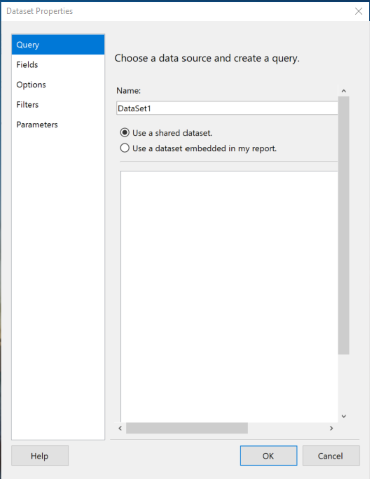

# Lesson 3: Define a Dataset for the Table Report - SQL Server Reporting Services

After you define the data source for the paginated report, you need to define a dataset. In [!INCLUDE[ssrsnoversion](../includes/ssrsnoversion-md.md)], data that you use in reports is contained in a *dataset*. A dataset includes a pointer to a data source and a query to be used by the report, calculated fields, and variables.

Use the Query Designer in Report Designer to define the dataset. For this tutorial, you're going to create a query that retrieves sales order information from the AdventureWorks2016 database.

## Define a Transact-SQL query for report data  

1. In the **Report Data** pane, select **New** > **Dataset...**. The **Dataset Properties** dialog box opens with the **Query** section displayed.

    

2. In the **Name** text box, type "AdventureWorksDataset".

3. Below that, select the **Use a dataset embedded in my report** radio button.

4. From the **Data source** dropdown box, select AdventureWorks2016.

5. For the **Query type**, select the **Text** radio button.

6. Type, or copy and paste, the following Transact-SQL query into the **Query** text box.

    ```T-SQL
    SELECT
       soh.OrderDate AS [Date],
       soh.SalesOrderNumber AS [Order],
       pps.Name AS [Subcat],
       pp.Name as [Product],
       SUM(sd.OrderQty) AS [Qty],
       SUM(sd.LineTotal) AS [LineTotal]
    FROM Sales.SalesPerson sp
    INNER JOIN Sales.SalesOrderHeader AS soh
          ON sp.BusinessEntityID = soh.SalesPersonID
       INNER JOIN Sales.SalesOrderDetail AS sd
          ON sd.SalesOrderID = soh.SalesOrderID
       INNER JOIN Production.Product AS pp
          ON sd.ProductID = pp.ProductID
       INNER JOIN Production.ProductSubcategory AS pps
          ON pp.ProductSubcategoryID = pps.ProductSubcategoryID
       INNER JOIN Production.ProductCategory AS ppc
          ON ppc.ProductCategoryID = pps.ProductCategoryID
    GROUP BY ppc.Name, soh.OrderDate, soh.SalesOrderNumber, pps.Name, pp.Name,soh.SalesPersonID  
    HAVING ppc.Name = 'Clothing'
    ```

7. (Optional) Select the **Query Designer** button. The query is displayed in the text-based *Query Designer*. View the results of the query by selecting the  **run** button on the **Query Designer** toolbar. The dataset displayed contains six fields from four tables in the AdventureWorks2016 database. The query makes use of Transact-SQL functionality such as aliases. For example, the SalesOrderHeader table is called *soh*.

8. Select **OK** to exit the **Query Designer**.

9. Select **OK** to exit the **Dataset Properties** dialog box.

The **Report Data** pane displays the AdventureWorksDataset dataset and fields.

   

## Next steps

You've successfully specified a query that retrieves data for your report. Next, you're going to create the report layout. Continue with [Lesson 4: Adding a Table to the Report &#40;Reporting Services&#41;](lesson-4-adding-a-table-to-the-report-reporting-services.md).

## See also

[Query Design Tools &#40;SSRS&#41;](../reporting-services/report-data/query-design-tools-ssrs.md)
[SQL Server Connection Type &#40;SSRS&#41;](../reporting-services/report-data/sql-server-connection-type-ssrs.md)
[Tutorial: Writing Transact-SQL Statements](../t-sql/tutorial-writing-transact-sql-statements.md)
